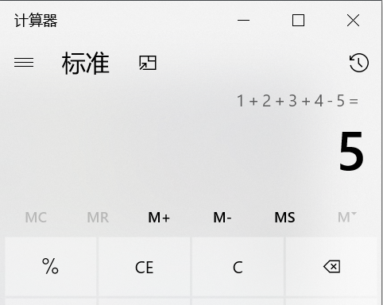
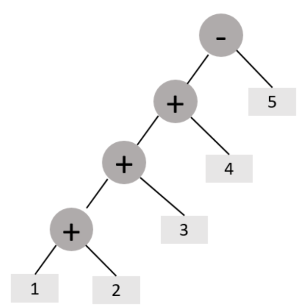
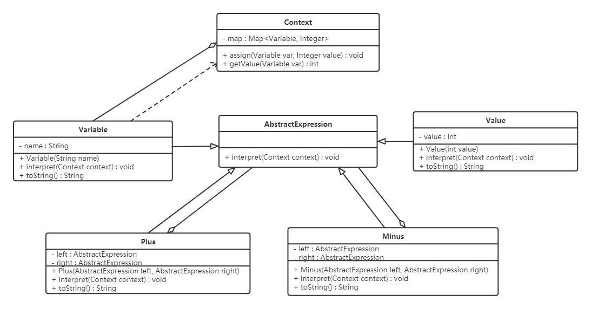

## 意图

**解释器模式**是一种行为设计模式， 它给定一种语言，定义它的文法的一种表示， 并定义一个解释器， 这个解释器使用该表示来解释语言中的句子。



## 问题

假如你开发了一款简单的计算器程序， 它需要解析诸如 `1+2+3-4` 这样的算术表达式。 一个常见做法是， 你为每一种运算都写一个工具方法—— `add()`、`minus()` 等等。 当表达式越来越复杂时（加入 `*`、`/`、括号、不同优先级）， 工具方法会迅速膨胀， 而且彼此之间还会纠缠不清。

更进一步， 如果你打算让用户能自定义变量——例如 `a + b * 2`——那么问题就更棘手了： 你需要为每一种变量、每一种组合都做特殊处理。 当文法变复杂时， 工具方法这条路会很快走到尽头。

## 解决方案

解释器模式建议将**运算符**和**数字**都看成一种"节点"， 逐个节点地进行解析与计算。 当你把算式抽象为一种"小语言"后， 就可以构造一棵**抽象语法树（AST）** 来表示它， 并让解释器递归地遍历这棵树， 得出最终结果。

举例来说， 表达式 `1 + 2 - 3 + 4` 可以被表示成如下一棵抽象语法树：



树上的每个节点都对应一种语法结构： 数字是叶子节点， `+`、`-` 等运算符是中间节点（它们有左右两个子节点）。 解释器只需要在每个节点上执行相同的 `interpret()` 方法， 由节点自己决定是返回一个数值（终结符）还是把左右子树的解释结果合起来（非终结符）。

这种"递归 + 抽象语法树"的做法看似朴实， 实际上**几乎所有编译器**都在用： 解析源代码 → 构造 AST → 解释或编译执行。 解释器模式让我们能够为一种自定义的小语言， 用 OO 的方式去实现同样的过程。

## 真实世界类比



想象一位钢琴演奏者正在读谱演奏。 乐谱定义了"音乐语言"的文法： 音符是高音还是低音、 节拍是 4/4 还是 3/4、 哪些小节要渐强。 演奏者本人就是"解释器"—— 他把乐谱这种**静态表示**实时翻译成**实际的声音**。

- 乐谱 = 文法表示（语法规则 + 抽象语法树）
- 演奏者 = 解释器（解释器对象）
- 实际演奏 = 解释结果

## 解释器模式结构

-

**抽象表达式**（`Abstract Expression`） 声明 `interpret(Context)` 方法。 所有节点都要实现它。

-

**终结符表达式**（`Terminal Expression`） 是抽象表达式的子类， 表示文法中的最小单元。 例如数字、变量。 它们直接返回自己的字面值， 不再递归。

-

**非终结符表达式**（`Nonterminal Expression`） 也是抽象表达式的子类， 表示文法中的复合规则。 例如 `+`、`-`、`*`、`/` 运算符。 它们通常持有左右两个子表达式， 在 `interpret()` 中先递归解释子树， 再把结果按规则合起来。

-

**上下文**（`Context`） 保存所有解释器共享的数据。 在最简形式中， 它就是一个"变量名 → 数值"的映射表； 但你也可以加入作用域、类型、调试钩子等。

-

**客户端**（`Client`） 构建（手工或借助解析器）一棵抽象语法树， 然后在根节点上调 `interpret(Context)` 即可得到最终结果。

## 伪代码

下面以一个极简的"加减法计算器"为例， 演示解释器模式的核心结构。

```
// 抽象表达式：所有节点都要实现 interpret(Context)
interface AbstractExpression is
    method interpret(Context context): Number

// 终结符：数字字面值
class Number implements AbstractExpression is
    field value: Number
    constructor Number(value) is
        this.value = value
    method interpret(context): Number is
        return value  // 数字直接返回

// 终结符：变量（从 Context 里查值）
class Variable implements AbstractExpression is
    field name: String
    constructor Variable(name) is
        this.name = name
    method interpret(context): Number is
        return context.get(name)

// 非终结符：加法
class Plus implements AbstractExpression is
    field left: AbstractExpression
    field right: AbstractExpression
    constructor Plus(left, right) is
        this.left = left
        this.right = right
    method interpret(context): Number is
        return left.interpret(context) + right.interpret(context)

// 非终结符：减法
class Minus implements AbstractExpression is
    field left: AbstractExpression
    field right: AbstractExpression
    constructor Minus(left, right) is
        this.left = left
        this.right = right
    method interpret(context): Number is
        return left.interpret(context) - right.interpret(context)

// 上下文：保存"变量名 → 数值"映射
class Context is
    private map: Map<String, Number>
    method assign(name, value) is
        map.put(name, value)
    method get(name): Number is
        return map.get(name)

// 客户端：手工构造 AST 并求值
context = new Context()
context.assign("a", 1)
context.assign("b", 2)
context.assign("c", 4)

// 表达式: (a + b) * (c - a)
expr = new Plus(
    new Variable("a"),
    new Minus(new Variable("c"), new Variable("a"))
)
result = expr.interpret(context)  // = 1 + (4 - 1) = 4
```

## 解释器模式适合应用场景

- 当一种**语言**需要被解释执行， 并且你能把语言中的句子表示为**抽象语法树**时。
- 当文法**比较简单**时。 对于复杂的文法， 类的数量会急剧膨胀， 维护成本反而超过收益。
- 当**执行效率不是关键瓶颈**时。 解释器模式依赖大量递归与小对象， 比专用编译器慢得多。
- 当问题**重复出现**， 且可以用一种**简单的语言**来表达时。 例如规则引擎、表达式求值、DSL（领域特定语言）、正则引擎等。

## 实现方式

-

声明 `Abstract Expression` 接口， 约定一个 `interpret(Context): Result` 方法。 这里的 `Result` 一般是某种数值或对象， 根据你的语言决定。

-

对文法中的每个终结符（数字、变量、关键字）实现一个 `Terminal Expression`。 它们通常在构造时拿到字面值， `interpret` 时**直接返回**或去 Context 里查。

-

对文法中的每条规则（`+`、`-`、`if-then-else` 等）实现一个 `Nonterminal Expression`。 它们在构造时拿到**子表达式引用**， `interpret` 时**先递归解释子树**， 再按规则合并。

-

实现 `Context` 类， 提供"共享状态"接口。 最简形式是 `Map<String, Value>`； 复杂场景可以加入作用域栈、调试钩子、类型检查等。

-

**客户端负责构造 AST**。 你可以选择： ① 客户端代码手工 new 节点（最简）； ② 写一个独立的**解析器**（parser）把字符串文法转成 AST（更通用， 但工作量更大）。

-

在 AST 根节点上调用 `interpret(Context)`， 让递归自动展开。

## 解释器模式优缺点

-  *易于改变和扩展文法*。 你可以通过继承 `Abstract Expression` 来定义新的规则， 几乎不改动既有代码。
-  *易于实现文法*。 每种节点类（终结符 / 非终结符）的实现套路非常相似。
-  符合 *开闭原则*。 新增一种节点或新规则时， 既有节点类无需修改。

-  对于**复杂文法**会导致**类数量爆炸**。 每条规则至少对应一个类， 几十条规则的项目会非常笨重。
-  执行**效率较低**。 大量递归调用 + 大量小对象， 比直接 `eval()` 或专用编译器慢得多。

## 与其他模式的关系

- **复合模式**（Composite） 是解释器模式的**底层骨架**。 抽象语法树本身就是一棵组合树， 非终结符节点和终结符节点共享同一个 `Abstract Expression` 父类， 才能用统一的 `interpret()` 递归调用。
- **访问者模式**（Visitor） 经常被用来**增强解释器**： 当你不想在 `interpret()` 里堆一堆 `if-else` 处理不同节点类型时， 可以让 visitor 接管"对 AST 做什么"的部分（类型检查、代码生成、优化等）， 节点本身只负责结构。
- **享元模式**（Flyweight） 可以在**终结符节点**上共享字面值相同的实例（所有 `Number(2)` 共用一个对象）， 节省大量内存。
- **迭代器模式**（Iterator） 经常用于**遍历 AST 的子节点列表**， 配合 visitor 使用。
- **状态模式**（State） 与解释器模式共享"用对象表示上下文"的思路， 但前者强调"对象内部状态决定行为"， 后者强调"用对象表示语法结构"。

## 代码示例

下面给出一个**完整可运行**的 Java 实现（基于七七大示例的 Java 风格改写， 保留核心逻辑与中文注释）。

```java
import java.util.HashMap;
import java.util.Map;

/**
 * 抽象表达式：所有节点都必须实现 interpret(Context)
 */
interface AbstractExpression {
    int interpret(Context context);
}

/**
 * 终结符：数字字面值
 */
class Number implements AbstractExpression {
    private final int value;
    public Number(int value) { this.value = value; }
    @Override public int interpret(Context context) { return value; }
}

/**
 * 终结符：变量
 */
class Variable implements AbstractExpression {
    private final String name;
    public Variable(String name) { this.name = name; }
    @Override public int interpret(Context context) {
        Integer v = context.get(name);
        if (v == null) throw new RuntimeException("未定义变量: " + name);
        return v;
    }
    @Override public String toString() { return name; }
}

/**
 * 非终结符：加法
 */
class Plus implements AbstractExpression {
    private final AbstractExpression left;
    private final AbstractExpression right;
    public Plus(AbstractExpression left, AbstractExpression right) {
        this.left = left; this.right = right;
    }
    @Override public int interpret(Context context) {
        return left.interpret(context) + right.interpret(context);
    }
    @Override public String toString() { return "(" + left + " + " + right + ")"; }
}

/**
 * 非终结符：减法
 */
class Minus implements AbstractExpression {
    private final AbstractExpression left;
    private final AbstractExpression right;
    public Minus(AbstractExpression left, AbstractExpression right) {
        this.left = left; this.right = right;
    }
    @Override public int interpret(Context context) {
        return left.interpret(context) - right.interpret(context);
    }
    @Override public String toString() { return "(" + left + " - " + right + ")"; }
}

/**
 * 上下文：保存"变量名 → 数值"映射
 */
class Context {
    private final Map<String, Integer> map = new HashMap<>();
    public void assign(String name, int value) { map.put(name, value); }
    public Integer get(String name) { return map.get(name); }
}

/**
 * 客户端：手工构造 AST 并求值
 */
public class InterpreterDemo {
    public static void main(String[] args) {
        Context context = new Context();
        context.assign("a", 1);
        context.assign("b", 2);
        context.assign("c", 4);

        // 表达式: a + (c - a)  →  1 + (4 - 1) = 4
        AbstractExpression expr = new Plus(
            new Variable("a"),
            new Minus(new Variable("c"), new Variable("a"))
        );

        System.out.println(expr + " = " + expr.interpret(context));
        // 输出: (a + (c - a)) = 4
    }
}
```

## 额外内容

- 解释器模式**几乎从来不是首选**。 当文法变复杂时， 维护成本会远超收益。 实际工程里， 你更可能用 ANTLR、JavaCC 这样的**解析器生成器**来自动构造 AST， 再写 visitor 解释。
- 当你只想"动态求值"一个小表达式时， 很多语言自带 `eval()` 或表达式库（如 Java 的 SpEL、JavaScript 的 `eval()`）， 没必要为它专门实现解释器模式。
